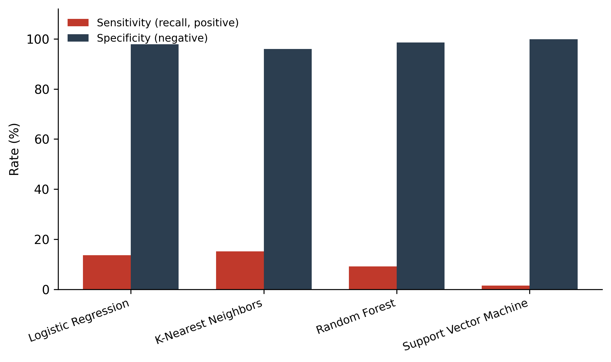
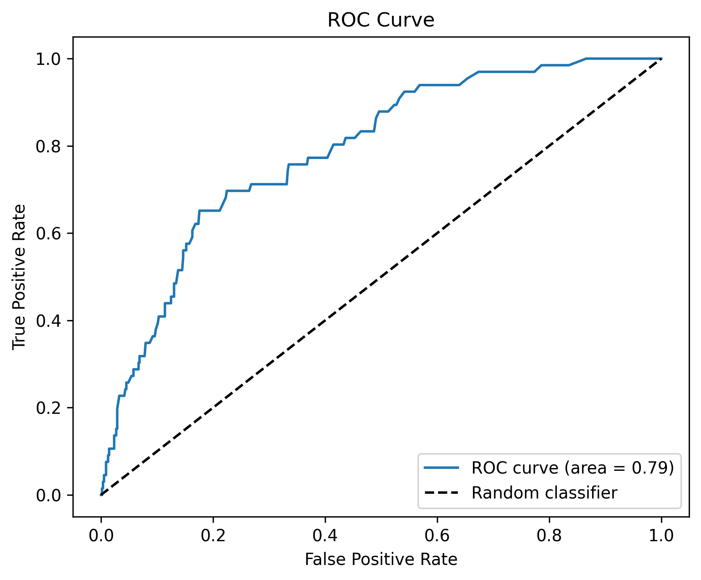
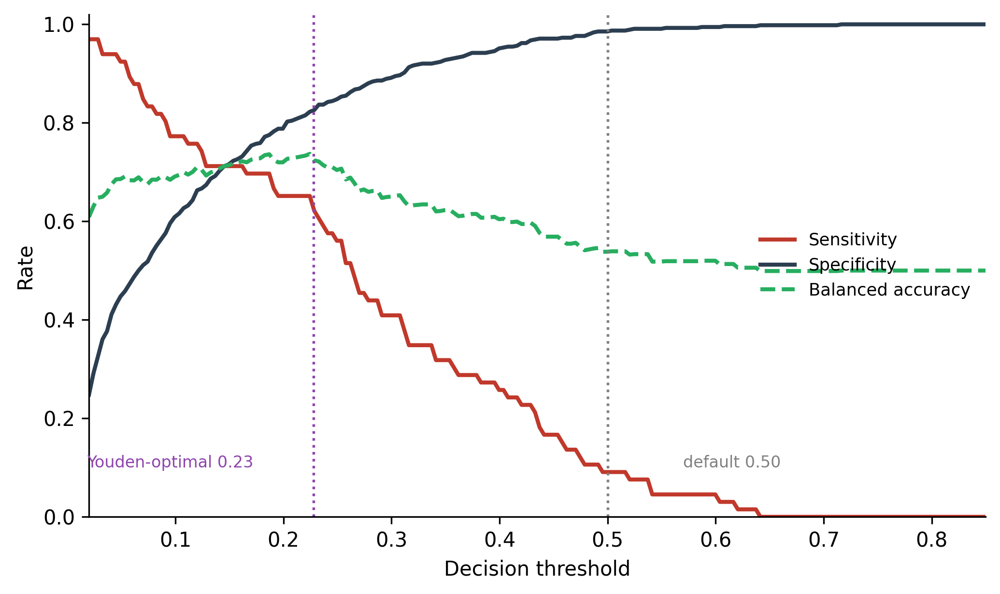
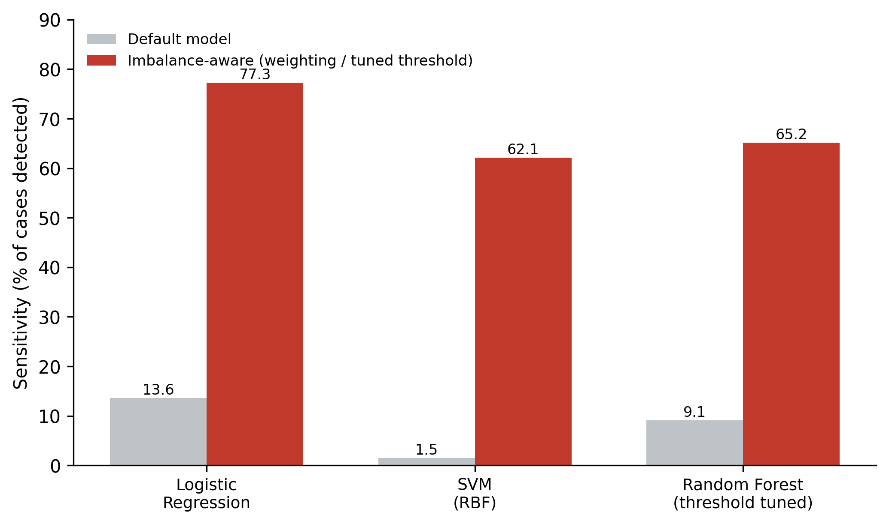

# Beyond Accuracy: Heart Disease Classification on Imbalanced Survey Data

Predicting self-reported heart disease from behavioral, medical, and demographic
features in the CDC BRFSS 2020 survey — and a case study in why **accuracy is the
wrong headline metric** when the classes are imbalanced.

## TL;DR

Four standard classifiers (Logistic Regression, KNN, Random Forest, SVM) all reach
~89% accuracy on this data. But:

- **None of them beats a model that predicts "no disease" for everyone** (the test
  set is 89.3% negative, so that trivial baseline also scores 89.3%).
- At default settings they detect only **1.5%–15.2%** of actual heart disease cases.

Two standard imbalance fixes recover most of the lost detection:

| Fix | Model | Sensitivity (before → after) |
|---|---|---|
| Class weighting | Logistic Regression | 13.6% → **77.3%** |
| Class weighting | SVM (RBF) | 1.5% → **62.1%** |
| Threshold tuning (0.50 → 0.228) | Random Forest | 9.1% → **65.2%** |

The Random Forest's ROC-AUC was **0.79** the whole time — the predictive signal was
there; the default 0.5 decision threshold was hiding it.

## Key figures

| | |
|---|---|
|  |  |
| Baseline models: high specificity, near-zero sensitivity | RF ranks cases well (AUC 0.79) despite poor thresholded detection |
|  |  |
| Moving the RF threshold trades specificity for sensitivity | Each fix lifts detection from near zero to ~two-thirds of cases |

## What's in here

```
heart_disease_imbalanced_classification.ipynb   # the full analysis, runs top to bottom
data/heart_2020_cleaned_edited.csv              # 3,087-row subset of the BRFSS-derived dataset
figures/                                        # generated plots (regenerated by the notebook)
requirements.txt
```

## Method

1. **Preprocess** — one-hot encode categoricals (drop-first), standardize continuous
   features (scaler fit on train only), 80/20 split.
2. **Baseline** — train four classifiers at default settings; compare every model to a
   majority-class baseline.
3. **Diagnose** — report sensitivity, specificity, balanced accuracy, and ROC/PR
   curves instead of relying on accuracy.
4. **Fix** — apply `class_weight="balanced"`, then tune the Random Forest decision
   threshold via Youden's J.

## Run it

```bash
pip install -r requirements.txt
jupyter notebook heart_disease_imbalanced_classification.ipynb
```

## Takeaways

- Accuracy and support-weighted F1 are dominated by the majority class under skew —
  use sensitivity, balanced accuracy, and precision-recall analysis.
- Always compare against a majority-class baseline; it instantly exposes a model that
  learned nothing beyond the prior.
- The most effective imbalance fix depends on how the model makes decisions:
  weighting worked for the linear/kernel models, threshold tuning for the ensemble.

## Limitations

- ~1% subset of the full ~319k-row BRFSS 2020 dataset.
- Single non-stratified split; the Youden threshold is selected on the test set
  (optimistic — a clean pipeline selects it on a separate validation split).
- Self-reported, cross-sectional survey data: associations, not diagnosis.

