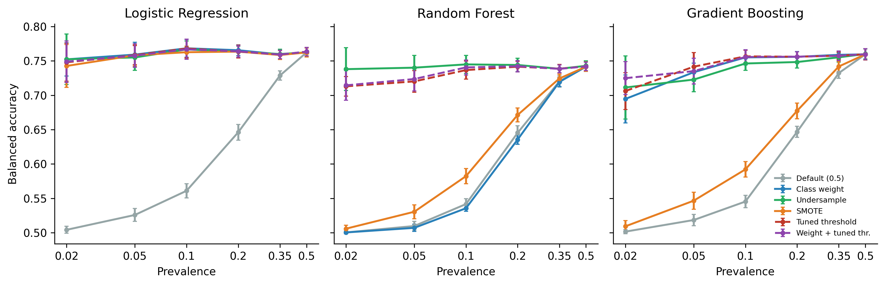
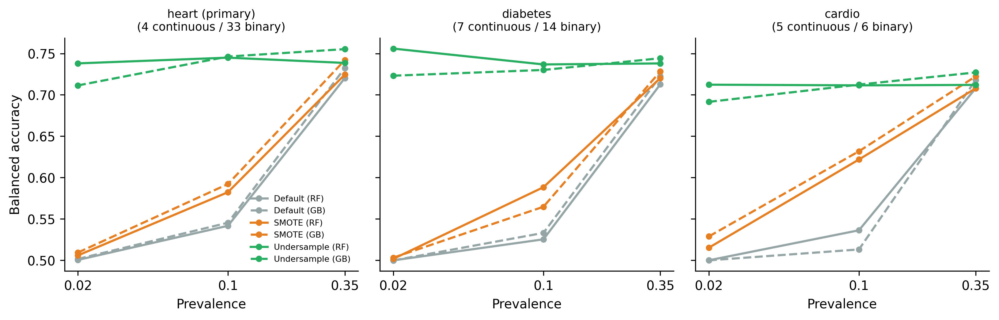

# When Do Class-Imbalance Corrections Succeed?

Everyone says to fix class imbalance by reweighting or resampling. This project
tested that advice across six disease prevalence levels, three model families, and
three datasets, and found that the most commonly recommended fix does nothing for
one of the most commonly used models, and once made things measurably worse.

**1,920 model evaluations. Every threshold selected on validation data, never test.**

---

## The five findings

**1. Default models fail completely at low prevalence, and the failure is invisible in accuracy.**
At 2% prevalence all three model families score ~0.50 balanced accuracy, which is
chance. They detect between 0.1% and 0.9% of true cases while still reporting high
overall accuracy.

**2. Corrections stop mattering above ~35% prevalence.**
The gap between the best and worst strategy is 0.21-0.24 balanced-accuracy points at
2% prevalence. At 35% it is 0.017. At 50% it is 0.001.

**3. Class weighting does nothing for Random Forest, and at 10% prevalence it is
significantly worse than doing nothing (p = 0.014).**
It works fine for Logistic Regression and Gradient Boosting. The failure is specific
to the bagged majority-vote ensemble, and it replicated on all three datasets.

**4. SMOTE fails for tree ensembles, but only on binary-dominant feature spaces.**
This started as a hypothesis: SMOTE interpolates between minority neighbors, which
produces fractional values on one-hot indicators that no real record can have. Tested
on three datasets ordered by continuous-feature share, SMOTE recovers for Random
Forest exactly as continuous features come to dominate (0.582 -> 0.588 -> 0.622).
A prediction that held.

**5. Tuning the decision threshold on validation data works for every model at every
prevalence, with zero retraining, and the right threshold is approximately the
prevalence itself.**
ROC-AUC barely moves across training-time corrections (differences of 0.00-0.02),
which is why: the corrections were never improving the learned ranking, only the
operating point.



*Watch the Random Forest panel. The class-weight line (blue) sits exactly on the
do-nothing line (grey) at every prevalence.*

---

## The mechanism test

The SMOTE explanation was a falsifiable prediction, so it got tested on datasets
chosen specifically to vary the property it depends on:

| Dataset | Records | Continuous / binary features | SMOTE recovers RF? |
|---|---|---|---|
| BRFSS 2020 heart disease | 319,795 | 4 / 33 | No |
| BRFSS 2015 diabetes | 253,680 | 7 / 14 | No |
| Cardiovascular exams | 70,000 | 5 / 6 | Yes |



---

## Experimental design

- **Controlled prevalence.** Datasets built at 2, 5, 10, 20, 35, and 50% prevalence
  (N = 20,000 each) by stratified subsampling from the full 319,795-record BRFSS 2020
  dataset, 10 random seeds per level. Every record is real; no synthetic records are
  used to hit a target prevalence.
- **3 model families** (Logistic Regression, Random Forest, Gradient Boosting)
  x **6 strategies** (default, class weighting, random undersampling, SMOTE,
  validation-tuned threshold, weighting + threshold) = **1,080 evaluations**.
- **Replication:** 540 further evaluations on two additional datasets.
- **Focal loss:** 300 further evaluations, including a from-scratch focal objective
  for logistic regression (analytic gradient, verified against finite differences to
  < 1e-5) and a custom LightGBM objective.
- **60/20/20 stratified splits.** Thresholds are selected on validation and evaluated
  on a test partition that is touched exactly once.

---

## Repository contents

```
imbalance_prevalence_sweep.ipynb   Full analysis, runs top to bottom, outputs included
experiment.py                      Main prevalence sweep
experiment2.py                     Replication datasets + focal loss (incl. gradcheck)
download_data.py                   Fetches all three datasets
results/results.csv                1,080 primary evaluations
results/results_ext.csv            540 replication evaluations
results/results_focal.csv          300 focal-loss evaluations
figures/                           All five figures
paper/                             Manuscript write-up
```

## Running it

```bash
pip install -r requirements.txt
python download_data.py

# Reproduce everything from scratch (~20-30 min):
python experiment.py 0.02 0.05 0.10 0.20 0.35 0.50
python experiment2.py cardio 0.02 0.10 0.35
python experiment2.py diabetes 0.02 0.10 0.35
python experiment2.py focal 0.02 0.05 0.10 0.20 0.35 0.50

# Verify the focal-loss gradient implementation:
python experiment2.py gradcheck

# Or read the analysis with cached results:
jupyter notebook imbalance_prevalence_sweep.ipynb
```

The notebook loads cached results by default. Set `FORCE_RERUN = True` in the setup
cell to regenerate the main sweep.

---

## Practical takeaways

- Below ~20% prevalence, correct for imbalance. Above ~35%, do not bother.
- With tree ensembles, prefer **undersampling or threshold tuning**. Class weighting
  and SMOTE are the two that failed.
- Tune the decision threshold on a validation split. It works everywhere, costs
  nothing, and leaves model calibration intact.
- A good starting cutoff for an uncorrected model is **the prevalence**, not 0.5.
- Never report accuracy alone on imbalanced data, and always compare against a
  majority-class baseline.

## Limitations

Three datasets, all clinical survey data. The replication used 3 prevalence levels
with 5 seeds rather than the full 6x10 design. One dataset size (N = 20,000), one
threshold objective (Youden's J). Calibration-aware operating-point selection,
cost-weighted thresholds, and per-tree balanced Random Forest variants were not
evaluated. Prevalence was manipulated by subsampling, which changes the class mix but
not the within-class covariate distributions.

## Data sources

All public and de-identified. Original sources:
[BRFSS 2020 heart disease](https://www.kaggle.com/datasets/kamilpytlak/personal-key-indicators-of-heart-disease),
[cardiovascular disease](https://www.kaggle.com/datasets/sulianova/cardiovascular-disease-dataset),
[BRFSS 2015 diabetes](https://www.kaggle.com/datasets/alexteboul/diabetes-health-indicators-dataset).
